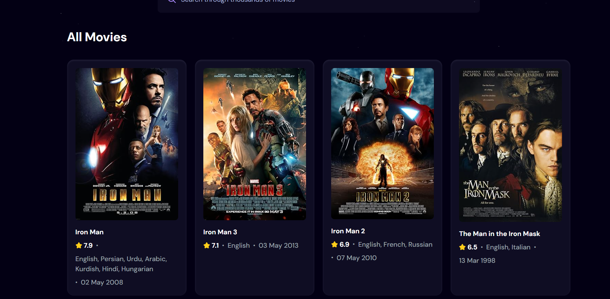

# 🎬 Filmey

**Filmey** is a movie browsing web app built with **React** and powered by the **OMDb API**. Users can search for thousands of movies and get detailed information instantly.

## 🌐 Live Demo

🔗 [https://filmey.netlify.app](https://filmey.netlify.app)

## screenshot 

  

 

## 🚀 Features

- 🔍 Search movies using the OMDb API
- 📄 Display movie posters, titles, and release years
- 📱 Responsive design for mobile and desktop
- ⚡ Fast loading with Vite

## 🛠️ Tech Stack

- **React** (Frontend library)
- **Vite** (Build tool)
- **OMDb API** (Movie data)
- **Netlify** (Deployment)

---
